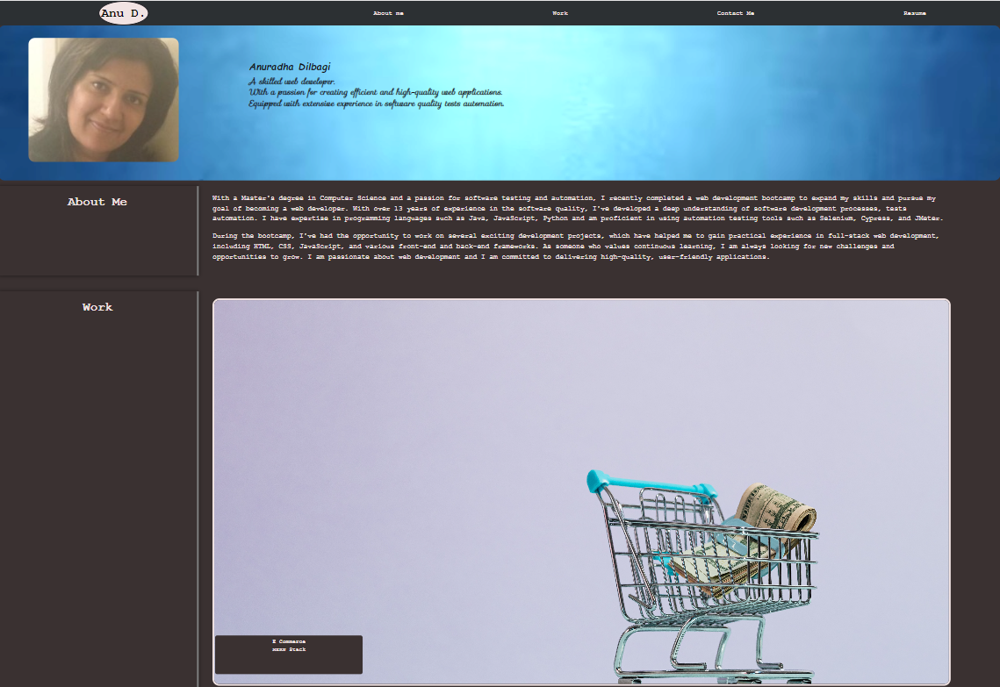
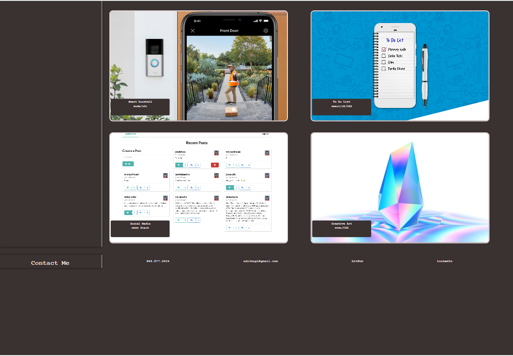

*Create Professional Portfolio*

#### The project involve creation of professional portfolio web page using HTML, advanced CSS to showcase the skills and talents to employers
 
 

## Table Of Contents
- [Description](#description)
- [Tasks Accomplished](#tasks-completed)
- [Deployment Links](#deployment-links)
- [Screenshot](#screenshot)
- [References](#references)
 
 

### Description
This portfolio website is designed to highlight professional experience, coding skills, github web projects and share contact info.
The web project is developed using HTML and advanced CSS features - flexbox, media queries, and CSS variables. Webpage can be accessed on different devices e.g desktop, tablets, mobile devices.
The web page present responsive layout.

### Tasks Completed
Completed web project by accomplishing following tasks -
* Use of semantic HTML elements and ensuring web accessibilty standards are met
* Use of advanced CSS features to make web page more interactive, responsive. 
* Use of CSS variables, consolidation of selectors to make code more structured and easy to maintain.
* Tested web page on different screen sizes.
* Provided links to all of the deployed projects

### Screenshot
 

### Deployment Links
[Link of Deployed app ](https://anud22.github.io/myPortfolio/)

### References
[msdn web docs](https://developer.mozilla.org/en-US/docs/Web/HTML)
 
[w3 web docs](https://www.w3schools.com/)